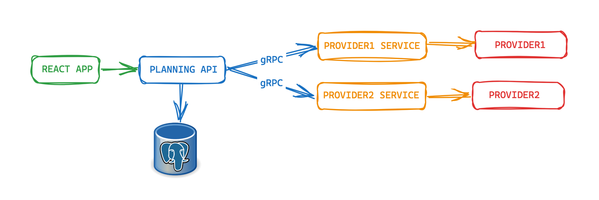

# TODO PLANNING


## FLOW


#### BUILD
```bash
make build
```

#### RUN
```bash
make run
```

---

#### PLANNING API
```
http://127.0.0.1:3000/api/v1/todo/planning
```

#### PLANNING APP
```
http://127.0.0.1:8080
```
---

#### PROVIDERPACKAGE : https://github.com/mkaganm/providergrpc
gRPC provider services are using this package.

---

Provider 1:
http://www.mocky.io/v2/5d47f24c330000623fa3ebfa

Provider 2:
http://www.mocky.io/v2/5d47f235330000623fa3ebf7

---

## PORTS

- 3000: PLANNING API
- 3001: PROVIDER1 gRPC SERVICE
- 3002: PROVIDER2 gRPC SERVICE
- 8080: REACT APP
- 5432: POSTGRES
- 5050: PGADMIN

## TECHS
- GOLANG
- FIBER
- GORM
- gRPC
- REACT
- POSTGRES


